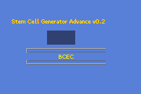
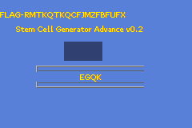

# nsec 2024: Stem Cells (I don't recall the exact name...)

The premise of this year's nsec was again company related, but this time we
were shrunk to work on our main customer's body! Somehow code was our way to
fix his bodily functions, so we could do something about this hot mess of a
man (truly, all of his body functions are gone).

## The challenge

Given with a `.gba` file and a potentially equivalent `.elf` file, we had to
fix our patient's genetics. Not much to go on until you start digging in! The
instructions definitely pushed us towards using a Game Boy emulator to run up
the image.

## The solve

### Part 1: Exploration

Let's start by checking if the `.gba` is indeed a valid Game Boy image:

```sh
> file stem_cell_generator_advance.gba
stem_cell_generator_advance.gba: Game Boy Advance ROM image: "level_1" (000000, Rev.00)
```

Alrighty then!

Now let's boot it. I never booted up a GBA image before, but quick googling let
me to "Visual Boy Advance". Let's try that!



It works! But the controls are wonky.

After fiddling around with the control settings of the emulator, a quick
overview of the game shows that we can go left to right to change the letter
our (invisible) cursor is on, and using up/down we can cycle through the alphabet. Pressing
enter (I don't know what's the real GBA equivalent, I never had one) will
submit our answer to the almighty algorithm, that tells us that we are wrong by
freezing the emulator (at least on my machine). At this point, it's pretty easy to
guess that the goal is unlocking the combination...

```python
>>> 26 ** 4
456976
```

That's moderately large, but not out of reach? It did seemed like a lot of
hassle to brute force through the emulator, and I hadn't looked at the elf file
yet. We'll brute force it if nothing else works.


### Part 2: Exploration with our friend Ghidra

It's now time to pray our .elf file has not been obfuscated to hell and back. Opening with
Ghidra and decompiling... Oh! Wait! What even is this elf? Is this the game?

```sh
> file stem_cell_generator_advance.elf
stem_cell_generator_advance.elf: ELF 32-bit LSB executable, ARM, EABI5 version 1 (SYSV), statically linked, not stripped
```

> The ARM7TDMI (ARM7 + 16 bit Thumb + JTAG Debug + fast Multiplier + enhanced ICE) processor implements the ARMv4 instruction set. It was licensed for manufacture by an array of semiconductor companies. In 2009, it was one of the most widely used ARM cores, and is found in numerous deeply embedded system designs. It was used in the popular video game console Game Boy Advance. 

So I guess it is the game!

Also what is also

> deeply embedded system designs

? lol

Looking around in Ghidra, we can see that stuff has been left to a sane state.
Which will help us, because there is _a lot_ of stuff to look at. Knowing it's probably a game,
I look for `loop`... and predictably, I find the `main_loop` function. Success.

```C
void main_loop(void) {
  undefined4 uVar1;
  int iVar2;
  undefined auStack_38 [20];
  undefined4 local_24;
  undefined4 local_20;
  undefined4 local_1c;
  char *local_18;
  undefined4 local_14;
  int local_10;
  int local_c;
  
  local_10 = tte_get_context();
  for (local_c = 0; local_c < 4; local_c = local_c + 1) {
    (&key_chars)[local_c * 0xc] = 0x41;
  }
  cursor._0_4_ = 0;
  uVar1 = bytes2word(0xd,0xf,0,0);
  tte_init_chr4c(0,0xa00,0xf000,uVar1,0,&verdana9_b4Font,chr4c_drawg_b4cts_fast);
  tte_init_con();
  LZ77UnCompVram(&dungeon01Map,0x6006000);
  LZ77UnCompVram(&dungeon01Tiles,0x6008000);
  LZ77UnCompVram(&dungeon01Pal,0x5000000);
  local_14 = tte_get_surface();
  srf_init(auStack_38,5,&dlgboxTiles,0xf0,0x20,4,&dlgboxPal);
  srf_pal_copy(local_14,auStack_38,0x10);
  schr4c_blit(local_14,0x28,0x50,0x8c,0x50,auStack_38,0,0);
  local_18 = "#{P}#{ci:1;cs:2}#{ci:13;cs:15}#{ci:1;cs:2}#{ci:13;cs:15}\n#{ci:3;cs:4}#{ci:7;cs:9}";
  tte_write("#{P}#{ci:1;cs:2}#{ci:13;cs:15}#{ci:1;cs:2}#{ci:13;cs:15}\n#{ci:3;cs:4}#{ci:7;cs:9}");
  win_textbox(0,0x50,0x34,0x80,0x4c,8);
  tte_set_margins(0,0,0xf0,0xf0);
  local_1c = 0x80;
  local_20 = 0x20;
  local_24 = 0x40;
  _DAT_04000018 = 0x80;
  _DAT_0400001a = 0x20;
  _DAT_0400000c = 0xcc08;
  _DAT_04000000 = 0x2500;
  do {
    VBlankIntrWait();
    key_poll();
    tte_erase_line();
    iVar2 = key_hit(0x20);
    if ((iVar2 != 0) && (cursor._0_4_ = cursor._0_4_ + -1, (int)cursor._0_4_ < 0)) {
      cursor._0_4_ = 0;
    }
    iVar2 = key_hit(0x10);
    if ((iVar2 != 0) && (cursor._0_4_ = cursor._0_4_ + 1, 3 < (int)cursor._0_4_)) {
      cursor._0_4_ = 0;
    }
    iVar2 = key_hit(0x40);
    if ((iVar2 != 0) &&
       ((&key_chars)[cursor._0_4_ * 0xc] = (&key_chars)[cursor._0_4_ * 0xc] + '\x01',
       0x5a < (byte)(&key_chars)[cursor._0_4_ * 0xc])) {
      (&key_chars)[cursor._0_4_ * 0xc] = 0x41;
    }
    iVar2 = key_hit(0x80);
    if ((iVar2 != 0) &&
       ((&key_chars)[cursor._0_4_ * 0xc] = (&key_chars)[cursor._0_4_ * 0xc] + -1,
       (byte)(&key_chars)[cursor._0_4_ * 0xc] < 0x41)) {
      (&key_chars)[cursor._0_4_ * 0xc] = 0x5a;
    }
    *(undefined2 *)(local_10 + 0x14) = 0x14;
    *(undefined2 *)(local_10 + 0x16) = 0x1e;
    tte_write("Stem Cell Generator Advance v0.2");
    *(undefined2 *)(local_10 + 0x14) = 100;
    *(undefined2 *)(local_10 + 0x16) = 0x5a;
    for (local_c = 0; local_c < 4; local_c = local_c + 1) {
      tte_putc((&key_chars)[local_c * 0xc]);
    }
    iVar2 = key_hit(8);
    if (iVar2 != 0) {
      process_blood_type();
    }
  } while( true );
}
```

Oh lord. It looks like Ghidra wasn't too sure of the types of some variable but
it's not a big deal. We can quickly spot some juicy stuff however:

```C
    if ((iVar2 != 0) && (cursor._0_4_ = cursor._0_4_ + -1, (int)cursor._0_4_ < 0)) {
      cursor._0_4_ = 0;
    }
    iVar2 = key_hit(0x10);
    if ((iVar2 != 0) && (cursor._0_4_ = cursor._0_4_ + 1, 3 < (int)cursor._0_4_)) {
      cursor._0_4_ = 0;
    }
```

This matches code that would move the cursor sideways, with `cursor` being the
cursor variable.

And we have this nice nibblet:

```C
    if ((iVar2 != 0) &&
       ((&key_chars)[cursor._0_4_ * 0xc] = (&key_chars)[cursor._0_4_ * 0xc] + -1,
       (byte)(&key_chars)[cursor._0_4_ * 0xc] < 0x41)) {
      (&key_chars)[cursor._0_4_ * 0xc] = 0x5a;
    }
```

So at this point, it's pretty damn clear it's the game, and the main loop controls the
`key_chars`, which is the array of letters being selected. Reading some more, we strike
gold:

```C
  process_blood_type();
```

This _must_ be what happens when we submit our answer. Let's check it out.

### Part 3: Diving deeper and being really confused


```C
void process_blood_type(void) {
  int iVar1;
  undefined auStack_174 [4];
  undefined local_170;
  undefined auStack_16c [5];
  undefined local_167;
  undefined auStack_164 [5];
  undefined local_15f;
  undefined auStack_15c [292];
  char acStack_38 [28];
  char *local_1c;
  char *local_18;
  int local_14;
  
  memcpy(auStack_15c + 4,
         "GQMXGTNDCWCABEGWGBKDFJMJTBWFACYMMSHFFTNZMHGGXQEUZHVFTCPJCKUEAMGBSXABZRMTKQCFUFXWFJMZFBMFTM DXZMVZXSRPQTCMFMBKNVMVXZRQYQBGCQYYNVSNFGEWHKBDZJMXZSFEAUVSEPGQQYTKJNQMEEFHZQCFSXFDKVPSQMUPT JSMCRGNJZKCDJDQNSHTGPBMJUKUDQWMJUKMEYQFPZGXHCCTNPHYBUEQXSYCEMWQAHMVPNKYTAY"
         ,0x100);
  iVar1 = evaluation_routine();
  if (iVar1 != 1) {
    do {
      local_1c = 
      "#{P}#{ci:1;cs:2}#{ci:13;cs:15}#{ci:1;cs:2}#{ci:13;cs:15}\n#{ci:3;cs:4}#{ci:7;cs:9}";
      tte_write("#{P}#{ci:1;cs:2}#{ci:13;cs:15}#{ci:1;cs:2}#{ci:13;cs:15}\n#{ci:3;cs:4}#{ci:7;cs:9}"
               );
      tte_write("FAILURE");
    } while( true );
  }
  for (local_14 = 0; local_14 < 5; local_14 = local_14 + 1) {
    auStack_15c[local_14] = auStack_15c[(uint)key_chars + local_14 + 4];
  }
  auStack_15c[5] = 0;
  for (local_14 = 0; local_14 < 5; local_14 = local_14 + 1) {
    auStack_164[local_14] = auStack_15c[(uint)DAT_03000250 + local_14 + 4];
  }
  local_15f = 0;
  for (local_14 = 0; local_14 < 5; local_14 = local_14 + 1) {
    auStack_16c[local_14] = auStack_15c[(uint)DAT_0300025c + local_14 + 4];
  }
  local_167 = 0;
  for (local_14 = 0; local_14 < 4; local_14 = local_14 + 1) {
    auStack_174[local_14] = auStack_15c[(uint)DAT_03000268 + local_14 + 4];
  }
  local_170 = 0;
  do {
    local_18 = "#{P}#{ci:1;cs:2}#{ci:13;cs:15}#{ci:1;cs:2}#{ci:13;cs:15}\n#{ci:3;cs:4}#{ci:7;cs:9}";
    tte_write("#{P}#{ci:1;cs:2}#{ci:13;cs:15}#{ci:1;cs:2}#{ci:13;cs:15}\n#{ci:3;cs:4}#{ci:7;cs:9}");
    sprintf(acStack_38,"FLAG-%s%s%s%s",auStack_15c,auStack_164,auStack_16c,auStack_174);
    tte_write(acStack_38);
  } while( true );
}
```

Notice

```C
    sprintf(acStack_38,"FLAG-%s%s%s%s",auStack_15c,auStack_164,auStack_16c,auStack_174);
```

Looking in, it's pretty clear this builds the flag from 4 substrings. I imagine
each is computed from each letter, but I don't know that since they refer to
`key_chars`, `DAT_03000250`, `DAT_0300025c` and `DAT_03000268` respectively,
and beside `key_chars`, I don't know what the hell those `DAT_*` are.

Also take a look at 
```C
  iVar1 = evaluation_routine();
  if (iVar1 != 1) {
    do {
      local_1c = 
      "#{P}#{ci:1;cs:2}#{ci:13;cs:15}#{ci:1;cs:2}#{ci:13;cs:15}\n#{ci:3;cs:4}#{ci:7;cs:9}";
      tte_write("#{P}#{ci:1;cs:2}#{ci:13;cs:15}#{ci:1;cs:2}#{ci:13;cs:15}\n#{ci:3;cs:4}#{ci:7;cs:9}"
               );
      tte_write("FAILURE");
    } while( true );
  }
```

We have another nugget here; if we call `evaluation_routine` and do not get 1, we end up in a 
while loop. So far, except for `DAT_*`, everything seems as expected. Now let's look at `key_chars` in the dissassembly:

```
                             key_chars                                       XREF[18]:  (ommited)
        03000244                 undefined1 ??
        03000245                 ??         ??
        03000246                 ??         ??
        03000247                 ??         ??
        03000248                 ??         ??
        03000249                 ??         ??
        0300024a                 ??         ??
        0300024b                 ??         ??
        0300024c                 ??         ??
        0300024d                 ??         ??
        0300024e                 ??         ??
        0300024f                 ??         ??

```

`key_chars` is 12 bytes? 3 bytes per char? What? I wasted a bunch of time
exploring how this 3 bytes per char could work. But the code shown above does
not give any clue. I was also puzzled about the other symbols (only included is
`DAT_0300250`, the rest are the same).

```
                             DAT_03000250                                    XREF[2]:     evaluation_routine:08000586(R), 
                                                                                          process_blood_type:0800078c(R)  
        03000250                 undefined1 ??
        03000251                 ??         ??
        03000252                 ??         ??
        03000253                 ??         ??
        03000254                 ??         ??
        03000255                 ??         ??
        03000256                 ??         ??
        03000257                 ??         ??
        03000258                 ??         ??
        03000259                 ??         ??
        0300025a                 ??         ??
        0300025b                 ??         ??
```

Also 12 bytes...

Oh.

I'm stupid.

The addresses are all consecutive. It's 12 bytes PER char. Ah. Not much saner
(but it's ARM so I guess?), but it makes sense with the rest of the code:

```C
      // SAM:                      12
      (&key_chars)[cursor._0_4_ * 0xc] = 0x41; // SAM: flip to 'A' when rollover
```

Thankfully, I did not waste too much time on this (but more than I'll ever
admit).

Ok! So now I know that `key_chars` is refered in Ghidra as the first characters, and the `DAT_*`
refer to the following ones. Great! We can now dive in `evaluation_routine`!

### Part 4: The logic puzzle

```C
undefined8 evaluation_routine(void) {
  undefined4 uVar1;
  undefined4 in_lr;
  
  if ((key_chars & 0xf0) == 0x40) {
    if ((key_chars & 0xf) == 5) {
      if ((char)DAT_03000250 < '\0') {
        uVar1 = 0;
      }
      else if ((DAT_03000250 & 0x40) == 0) {
        uVar1 = 0;
      }
      else if ((DAT_03000250 & 0x20) == 0) {
        if ((DAT_03000250 & 0x10) == 0) {
          if ((DAT_03000250 & 8) == 0) {
            if ((DAT_03000250 & 4) == 0) {
              uVar1 = 0;
            }
            else if ((DAT_03000250 & 2) == 0) {
              uVar1 = 0;
            }
            else if ((DAT_03000250 & 1) == 0) {
              uVar1 = 0;
            }
            else if ((DAT_03000250 ^ DAT_0300025c) == 0x16) {
              if ((DAT_03000268 & 0x40) == 0x40) {
                if ((DAT_03000268 & 0xf) == 0xb) {
                  uVar1 = 1;
                }
                else {
                  uVar1 = 0;
                }
              }
              else {
                uVar1 = 0;
              }
            }
            else {
              uVar1 = 0;
            }
          }
          else {
            uVar1 = 0;
          }
        }
        else {
          uVar1 = 0;
        }
      }
      else {
        uVar1 = 0;
      }
    }
    else {
      uVar1 = 0;
    }
  }
  else {
    uVar1 = 0;
  }
  return CONCAT44(in_lr,uVar1);
}
```

Ah, yes. Great code right there (I know, it's probably Ghidra... or is it!). In
truth, we don't really care about the bottom half of the routine. Except for
the weird `CONCAT44` which is a Ghidra pseudo instruction, it even seems pretty
simple. The odd thing about the `CONCAT` is the `in_lr` variable which is refered
from _nowhere_, but we'll assume `uVar1` is enough and `in_lr` stays quiet at 0.

If `in_lr` is not 0, than the return result will *never* be equal to 1, so this
entire solve would have to backtrack. Let's think positive and move on.

The goal is now to get to the single `uVar1 = 1;` instruction by setting each
letter so it satisfies all the conditions thrown to them:

```C
  if ((key_chars & 0xf0) == 0x40) {
    if ((key_chars & 0xf) == 5) {
      if ((char)DAT_03000250 < '\0') {
        uVar1 = 0;
      }
      else if ((DAT_03000250 & 0x40) == 0) {
        uVar1 = 0;
      }
      else if ((DAT_03000250 & 0x20) == 0) {
        if ((DAT_03000250 & 0x10) == 0) {
          if ((DAT_03000250 & 8) == 0) {
            if ((DAT_03000250 & 4) == 0) {
              uVar1 = 0;
            }
            else if ((DAT_03000250 & 2) == 0) {
              uVar1 = 0;
            }
            else if ((DAT_03000250 & 1) == 0) {
              uVar1 = 0;
            }
            else if ((DAT_03000250 ^ DAT_0300025c) == 0x16) {
              if ((DAT_03000268 & 0x40) == 0x40) {
                if ((DAT_03000268 & 0xf) == 0xb) {
                  uVar1 = 1;
                }
```

Every instruction seems to compare only against a byte, so I'll assume each value is bound
within the capitalized alphabet and there's no odd shifting I missed. Here are all the
conditions I collected, with `C_i` being the `i`th letter:

```
C_0 & 0xF0 == 0x40
C_0 & 0x0F == 0x05

c_1 & 0x40 != 0
c_1 & 0x20 == 0
c_1 & 0x10 == 0
c_1 & 0x08 == 0
c_1 & 0x04 != 0
c_1 & 0x02 != 1

c_2 ^ c_1 == 0x16

c_3 & 0x40 == 0x40
c_3 & 0x0F == 0x0B
```

I _could_ compute that by hand, but...

### Part 5: Python, a hacker's best-friend

```Python
VALID = {(ord('A') + i) for i in range(26)}

def fc0():
    candidates = []
    for c0 in range(256):
        if (c0 & 0xF0 == 0x40) and (c0 & 0xF == 0x05):
            candidates.append(c0)
    candidates = list(set(candidates).intersection(VALID))
    print("C0 is within:", list(map(chr, candidates)))

def fc1():
    candidates = []
    for c1 in range(256):
        if (c1 & 0x40 != 0) and \
           (c1 & 0x20 == 0) and \
           (c1 & 0x10 == 0) and \
           (c1 & 0x08 == 0) and \
           (c1 & 0x04 != 0) and \
           (c1 & 0x02 != 1):
            candidates.append(c1)
    candidates = list(set(candidates).intersection(VALID))
    print("C1 is within:", list(map(chr, candidates)))
    return candidates
    
def fc2(fc1):
    candidates = []
    for c1 in fc1:
        for c2 in range(256):
            if (c2 ^ c1) == 0x16:
                candidates.append(c2)

    print("C2 is within:", list(map(chr, candidates)))

def fc3():
    candidates = []
    for c3 in range(256):
        if (c3 & 0x40 == 0x40) and (c3 & 0xF == 0x0B):
            candidates.append(c3)
    candidates = list(set(candidates).intersection(VALID))
    print("c3 is within:", list(map(chr, candidates)))

def main():
    fc0()
    c1 = fc1()
    fc2(c1)
    fc3()

if __name__ == "__main__":
    main()
```

Run and...

```
C0 is within: ['E']
C1 is within: ['D', 'E', 'F', 'G']
C2 is within: ['R', 'S', 'P', 'Q']
c3 is within: ['K']
```

Oh damnit. I was hoping for a single solution. Thankfully, because there is a
1:1 mapping between C1 and C2 (because of the xor, the arrays are aligned, so
there are 4 possible solutions, not 16). But it's also possible that I missed a
condition?

At this point my heart was pounding really hard. I had been struggling on
another problem before and was pretty down on myself, but I felt so close to a
breakthrough. I did not care if those multiple solutions were a mistake, I had
to try them.


Alright, 3 more solutions. There is hope.


Ok, this is getting annoying.


Oh I'm cooked here. This is not it. `in_lr` is some magic number never equal to
0 or something... Heart races faster, mental panic ensues, one last try...

<br/><br/>
<br/><br/>
<br/><br/>
<br/><br/>
<br/><br/>
<br/><br/>
<br/><br/>



Ah yes. The taste of a fresh flag. Problem SOLVED!

```sh
> askgod submit FLAG-...
3 points!
```


## Turning off the GBA, closing Ghidra and reflecting

Overall it was a cool challenge! It really wasn't that hard once I figured out
the 12 bytes per char quirk. The decompilation was monstruous but by looking
for `main_loop` I was able to narrow it down pretty quickly. I did not need to
rename symbols since it was all pretty easy to follow. Once I solve
(post-event) `rectum.elf` I'll make a post about it, since it's much more
complicated, and will teach me much more about reverse engineering and memory 
exploitation than this challenge. Knowing what I know now, it's also a good lesson
in using the proper tools for basic exploration.

